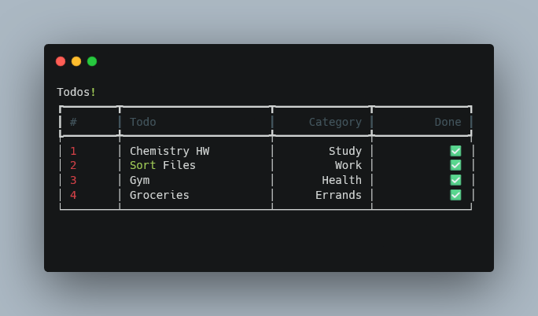

# Py Task Manager CLI

## Overview

Py Task Manager CLI is a simple, command-line interface (CLI) task manager built in Python. It helps you manage your tasks efficiently with an easy-to-use interface. 

## Features

- Add tasks
- View tasks
- Mark tasks as completed
- Delete tasks

## Screenshot



## Installation

1. Clone the repository:
   ```bash
   git clone https://github.com/Vardhu2706/py-task-manager-cli.git
   ```

2. Navigate to the project directory:
   ```bash
   cd py-task-manager-cli
   ```

## Usage

To start using the task manager, run the main script:
```bash
python todocli.py show
```
